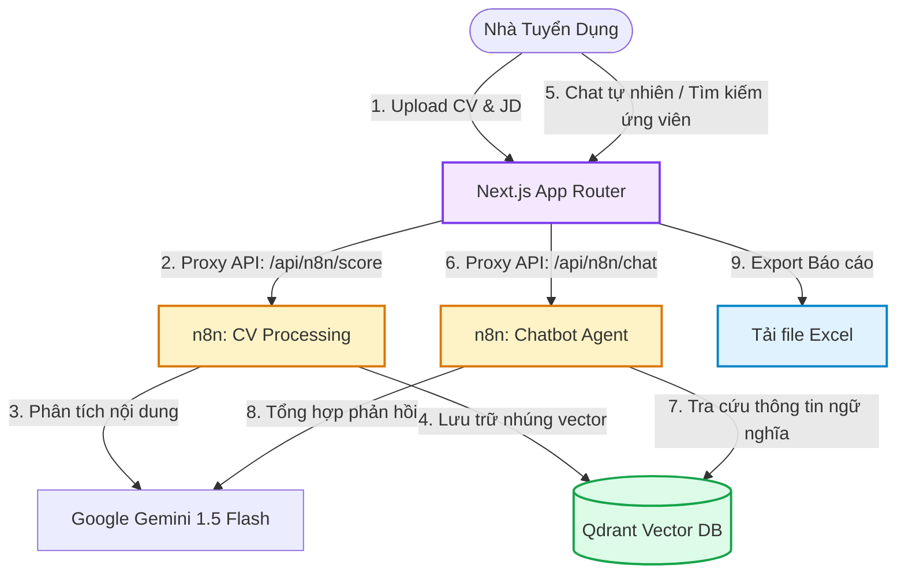

# 🚀 recruitPRO - Hệ thống Tuyển dụng AI Thông minh

Chào mừng bạn đến với **recruitPRO** — một hệ thống tuyển dụng hiện đại được tối ưu hóa bằng AI, được xây dựng trên nền tảng **Next.js App Router**, **n8n workflows**, và cơ sở dữ liệu vector **Qdrant**. Dự án tự động hóa toàn bộ quy trình sàng lọc hồ sơ ứng viên (CV), so khớp và chấm điểm độ tương thích với mô tả công việc (JD), đồng thời cung cấp trợ lý Chatbot AI để nhà tuyển dụng truy vấn dữ liệu thời gian thực.

Tài liệu này được biên soạn bởi **Kỹ sư Hướng dẫn (Tutorial Engineer)** để hỗ trợ các lập trình viên thiết lập môi trường chạy thử cục bộ (local build) và hiểu rõ nguyên lý hoạt động của các tính năng.

---

## 🎯 Mục tiêu Tài liệu & Kết quả Đạt được

Sau khi đi hết tài liệu hướng dẫn này, bạn sẽ:
* **Thiết lập thành công** dự án chạy cục bộ trên máy tính của bạn ở chế độ giả lập (Mock) hoặc kết nối thực tế (Live).
* **Hiểu rõ luồng dữ liệu** tương tác giữa Next.js, n8n webhook, OpenAI, và Qdrant DB.
* **Biết cách sử dụng & kiểm thử** tất cả 5 tính năng cốt lõi của hệ thống.
* **Biết cách tự khắc phục** các lỗi thường gặp trong quá trình tích hợp.

### ⏱️ Thời gian thiết lập ước tính:
* **Chế độ Mock (Nhanh):** 5 phút
* **Chế độ Live (Đầy đủ):** 20 phút

---

## 🏗️ Kiến trúc & Luồng hoạt động hệ thống

Dưới đây là sơ đồ Mermaid thể hiện cách các thành phần trong hệ thống recruitPRO giao tiếp với nhau:



---

## 🛠️ Điều kiện Tiên quyết (Prerequisites)

Để thiết lập hệ thống ở chế độ **Live** (kết nối thực tế), máy tính của bạn cần sẵn sàng các công cụ sau:
1. **Node.js** (Phiên bản v18.0.0 hoặc cao hơn).
2. **Docker Desktop** (Để chạy n8n và cơ sở dữ liệu Vector Qdrant qua Docker Compose).
3. **Google AI Studio API Key** (Dùng để chạy mô hình Gemini 1.5 Flash trích xuất và nhúng dữ liệu miễn phí trong n8n).

---

## ⚡ Phần 1: Chạy nhanh bằng Chế độ Mock Data (Quick Start - 5 phút)

Nếu bạn chỉ muốn thử nghiệm giao diện người dùng và kiểm tra độ mượt mà của các thành phần UI mà không cần cài đặt n8n hay cơ sở dữ liệu vector, hãy sử dụng chế độ **Mock Data**.

### Bước 1.1: Tải mã nguồn & Cài đặt thư viện
Mở terminal tại thư mục gốc của dự án và chạy:
```bash
# Cài đặt tất cả các dependencies từ package.json
npm install
```

### Bước 1.2: Thiết lập file cấu hình môi trường giả lập
Tạo một file `.env.local` ở thư mục gốc của dự án với nội dung:
```env
# Kích hoạt chế độ Mock Data
NEXT_PUBLIC_USE_MOCK_DATA=true

# (Không cần cấu hình các thông số n8n ở chế độ này)
N8N_WEBHOOK_BASE=http://localhost:5678/webhook
N8N_API_KEY=mock_key
```

### Bước 1.3: Chạy ứng dụng trên Localhost
Chạy lệnh khởi động máy chủ phát triển (Development server):
```bash
npm run dev
```

Mở trình duyệt và truy cập: **[http://localhost:3001](http://localhost:3001)**. 
Bạn có thể tải lên các file CV giả lập, hệ thống sẽ tự động tạo dữ liệu kết quả chấm điểm ngẫu nhiên tuyệt đẹp để bạn trải nghiệm.

---

## 🐳 Phần 2: Thiết lập Đầy đủ Hệ thống Thực tế (Deep Dive - 20 phút)

Để ứng dụng phân tích đúng các file CV thực tế bằng AI và thực hiện RAG Chatbot, chúng ta cần liên kết Next.js với n8n và Qdrant.

### Bước 2.1: Chạy n8n và Qdrant bằng Docker Compose
Khởi chạy đồng thời cả n8n và cơ sở dữ liệu vector Qdrant bằng cách sử dụng file `docker-compose.yml` có sẵn tại thư mục gốc:
```bash
docker compose up -d
```

> [!TIP]
> * Giao diện n8n hoạt động tại: [http://localhost:5678](http://localhost:5678)
> * Qdrant Dashboard hoạt động tại: [http://localhost:6333/dashboard](http://localhost:6333/dashboard)

### Bước 2.2: Thiết lập n8n Workflows
Thư mục `workflow/` chứa sẵn các cấu hình luồng tự động hóa dạng JSON. Bạn cần import chúng vào tài khoản n8n của mình:

1. Mở giao diện n8n của bạn -> Chọn **Workflows** -> **Add workflow** -> **Import from file...**
2. Lần lượt nhập các file từ thư mục `workflow/`:
   * **`CV Processing LLM Pipeline (Final).json`**: Nhận text CV và JD, gửi đến Google Gemini để trích xuất cấu trúc ứng viên, phân tích điểm mạnh, điểm yếu và gửi vectors đến Qdrant.
   * **`Chatbot_Web_Fixed.json`**: Tiếp nhận tin nhắn từ giao diện Chat của Next.js, thực hiện tìm kiếm ngữ nghĩa trên Qdrant và trả về kết quả bằng Google Gemini AI.
   * **`JD_Extraction.json`**: Trích xuất nhanh các thông số từ văn bản JD nhập vào.
   * **`Send Email.json`**: Xử lý logic gửi thư phản hồi cho ứng viên được chọn/loại.
3. Kích hoạt (**Active**) tất cả các workflow này trong n8n.
4. Lấy các địa chỉ **Production Webhook URL** (hoặc Test Webhook URL nếu bạn đang debug) của từng workflow.

### Bước 2.3: Thiết lập các biến môi trường `.env.local` đầy đủ
Tạo/Cập nhật file `.env.local` ở thư mục gốc để Next.js trỏ đến các webhook n8n tương ứng:

```env
# ĐẶT LÀ FALSE để tắt chế độ giả lập, sử dụng kết nối thực tế với n8n
NEXT_PUBLIC_USE_MOCK_DATA=false

# n8n Base Webhook URL (Dùng làm fallback nếu không khai báo chi tiết)
N8N_WEBHOOK_BASE=http://localhost:5678/webhook

# Khóa bảo mật API nếu n8n yêu cầu Authentication qua Header X-N8N-API-KEY
N8N_API_KEY=your_secure_api_key

# --- CHI TIẾT ĐƯỜNG DẪN WEBHOOK CỦA TỪNG TÍNH NĂNG ---

# Webhook xử lý và phân tích chấm điểm CV
N8N_SCORE_WEBHOOK_URL=http://localhost:5678/webhook/hr-cv

# Webhook dùng cho Trợ lý ảo Chatbot (RAG)
N8N_CHAT_WEBHOOK_URL=http://localhost:5678/webhook/chatbot

# Webhook trích xuất yêu cầu từ JD
N8N_EXTRACTJD_WEBHOOK_URL=http://localhost:5678/webhook/jd-extraction

# Webhook gửi mail tự động đến ứng viên
N8N_SENDEMAIL_WEBHOOK_URL=http://localhost:5678/webhook/send-email
```

> [!WARNING]
> Nếu bạn chạy n8n bằng Docker trên cùng máy tính, hãy đảm bảo Next.js có thể kết nối được tới địa chỉ IP của n8n. Thay thế `localhost` bằng IP mạng nội bộ của bạn (ví dụ: `192.168.1.X`) hoặc `host.docker.internal` nếu cần thiết.

### Bước 2.4: Chạy ứng dụng và Kiểm nghiệm thực tế
```bash
# Khởi chạy server local
npm run dev
```
Truy cập **[http://localhost:3001](http://localhost:3001)** để trải nghiệm quy trình tự động hóa AI toàn phần.

---

## 🎨 Phần 3: Khám phá các Tính năng Chính & Nguyên lý Hoạt động

### 1. Phân tích & Chấm điểm CV Tự động
* **Cách sử dụng:** Vào trang `/upload`, dán nội dung JD của vị trí cần tuyển, sau đó chọn kéo thả các file CV (hỗ trợ `.pdf`, `.docx`, `.txt`). Nhấp nút phân tích.
* **Nguyên lý hoạt động:** 
  1. Next.js thực hiện phân tích rút trích văn bản thô (Text Extraction) từ file nhị phân ngay tại client/server Next.js thông qua thư viện `pdf2json` và `mammoth` (xem code tại [route.ts](file:///d:/code/CVs-web/app/api/extract-text/route.ts)).
  2. Đoạn văn bản thô được đẩy lên n8n webhook cùng với JD.
  3. AI phân tích xuất ra JSON chứa số năm kinh nghiệm, kỹ năng tìm thấy, học vấn, ưu nhược điểm.
  4. Hệ thống thực hiện chấm điểm theo công thức chuẩn hóa tại [cv-scorer.ts](file:///d:/code/CVs-web/services/cv-scorer.ts) với trọng số:
     $$\text{Tổng điểm} = (\text{Kinh nghiệm} \times 40\%) + (\text{Kỹ năng kỹ thuật} \times 30\%) + (\text{Học vấn} \times 10\%) + (\text{Dự án} \times 10\%) + (\text{Kỹ năng mềm} \times 10\%)$$

### 2. Dashboard Thông tin & Bảng xếp hạng (Leaderboard)
* **Cách sử dụng:** Truy cập `/dashboard` hoặc `/leaderboard`.
* **Mô tả tính năng:**
  * **Dashboard:** Hỗ trợ chuyển đổi nhanh giữa hai chế độ xem: Dạng lưới (Grid View - các thẻ ứng viên trực quan kèm biểu đồ radar điểm thành phần) và Dạng danh sách (Table View - bảng thông tin chi tiết).
  * **Leaderboard:** Thiết kế bục vinh danh (Podium) tuyệt đẹp cho **Top 3 ứng viên xuất sắc nhất** (hạng nhất nhận Vương miện 👑, hạng nhì 🥈 và hạng ba 🥉).
  * **Hành động:** Nhà tuyển dụng có thể chuyển đổi trạng thái hồ sơ của ứng viên thành *Shortlisted (Phù hợp)* hoặc *Rejected (Đã loại)*.

### 3. Trợ lý AI Chatbot RAG (Retrieval-Augmented Generation)
* **Cách sử dụng:** Nhấp vào nút Chatbot ở góc màn hình hoặc truy cập trang `/chat`.
* **Cách hoạt động:** Khi bạn gõ: *"Tìm cho tôi ứng viên có trên 3 năm kinh nghiệm React và TypeScript"*, tin nhắn được gửi tới n8n Chatbot Workflow. Workflow sẽ chuyển đổi câu hỏi thành vector, thực hiện tìm kiếm tương đồng trên Qdrant DB, lấy các đoạn hồ sơ phù hợp nhất làm ngữ cảnh (Context) rồi chuyển cho GPT-4 phản hồi chính xác thông tin ứng viên kèm đường dẫn CV gốc.
* **Gợi ý phỏng vấn:** Khi bạn hỏi: *"Gợi ý câu hỏi phỏng vấn cho ứng viên [Tên Ứng Viên]"*, Chatbot sẽ kích hoạt luồng trích xuất CV thô và gợi ý các câu hỏi chuyên môn sâu (Technical) lẫn câu hỏi ứng xử (Soft Skills) được thiết kế riêng cho ứng viên đó.

### 4. Xuất Báo cáo Excel chuyên nghiệp
* **Cách sử dụng:** Tại trang `/leaderboard`, nhấp nút **Export Excel**.
* **Nguyên lý hoạt động:** Sử dụng thư viện `exceljs` dựng trực tiếp file Excel trên trình duyệt. Tự động định dạng cột, tô đậm hàng đầu (Header), căn chỉnh độ rộng tối ưu và tự động xuống dòng (Wrap text) đối với cột kỹ năng và tóm tắt ứng viên để đảm bảo file tải về cực kỳ đẹp mắt và in ấn dễ dàng.

---

## 🔍 Phần 4: Hướng dẫn Khắc phục Sự cố (Troubleshooting)

Khi tiến hành thiết lập dự án trên local, bạn có thể gặp một số vấn đề sau:

| Hiện tượng lỗi | Nguyên nhân phổ biến | Cách khắc phục |
| :--- | :--- | :--- |
| **Lỗi `500 Server configuration error`** khi upload | Thiếu biến môi trường `N8N_WEBHOOK_BASE` hoặc URL webhook chi tiết trong `.env.local`. | Mở file `.env.local` kiểm tra kỹ xem đã điền đầy đủ và chính xác các đường dẫn webhook chưa. Khởi động lại ứng dụng Next.js để nhận cấu hình mới. |
| **Lỗi CORS** hoặc **Không thể kết nối đến n8n** | n8n chạy local đang chặn request từ port `3001` của Next.js hoặc do n8n chưa bật tùy chọn CORS. | Đảm bảo biến môi trường trong n8n cho phép CORS: `N8N_ENFORCE_SETTINGS_FILE_FOR_USERS=true` hoặc chạy n8n với tham số cấu hình CORS mở. Ngoài ra, tính năng Proxy của Next.js tại `app/api/n8n/[...path]/route.ts` đã được thiết kế để giải quyết triệt để lỗi CORS bằng cách chuyển tiếp request từ server-side. Hãy kiểm tra xem Server Next.js có kết nối được tới n8n không. |
| **Chatbot trả lời không liên quan** hoặc lỗi truy vấn | Qdrant chưa được tạo Collection hoặc Collection bị lệch chiều dữ liệu (Dimensions - thường là 1536 đối với OpenAI text-embedding-ada-002). | Đảm bảo workflow n8n khởi tạo Collection trên Qdrant trước khi nạp dữ liệu. Bạn hãy xóa Collection cũ trên Qdrant Dashboard và chạy lại workflow CV Processing để nạp lại dữ liệu từ đầu. |
| **Không đọc được file PDF/DOCX** | File CV bị lỗi định dạng nhị phân hoặc dung lượng quá lớn vượt quá giới hạn payload của API Next.js. | Kiểm tra lại file PDF/DOCX bằng cách mở trên máy. Thử nghiệm với các file định dạng đơn giản hơn trước. Kiểm tra log của terminal Next.js để xem thông báo chi tiết lỗi của `pdf2json` hoặc `mammoth`. |

---

## 🛠️ Công nghệ Sử dụng trong Dự án

* **Framework chính:** [Next.js 16 (App Router)](https://nextjs.org/)
* **Giao diện & UI:** [Tailwind CSS v4](https://tailwindcss.com/), [Radix UI](https://www.radix-ui.com/), [Lucide React](https://lucide.dev/)
* **Xử lý tài liệu:** `mammoth` (đọc file `.docx`), `pdf2json` (phân tích file `.pdf`)
* **Xuất file:** `exceljs` & `file-saver`
* **Công cụ Tự động hóa:** [n8n](https://n8n.io/)
* **Cơ sở dữ liệu Vector:** [Qdrant](https://qdrant.tech/)

---
*Chúc bạn có trải nghiệm tuyệt vời khi xây dựng và phát triển hệ thống recruitPRO! Nếu gặp bất kỳ vướng mắc nào, hãy tạo Issue hoặc thảo luận cùng đội ngũ.*