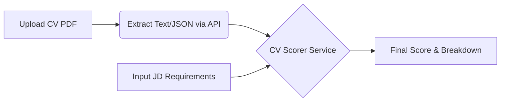

# Technical Specifications (SPECS): Deterministic CV Scoring Engine

## 1. Kiến trúc (Architecture)
Chuyển đổi từ mô hình "Blackbox Scoring" (N8N trả về điểm số sẵn) sang mô hình **"Hybrid Scoring"**:
1.  **AI Extraction Layer**: Sử dụng AI (N8N/OpenAI) *chỉ để trích xuất dữ liệu thô* (Raw Data Extraction) từ CV (Skills, Experience Years, Education...).
2.  **Deterministic Scoring Layer**: Sử dụng code TypeScript thuần (`services/cv-scorer.ts`) để tính toán điểm số dựa trên dữ liệu thô đã trích xuất. Điều này đảm bảo tính nhất quán (Consistency) và khả năng giải thích (Explainability) theo đúng trọng số PO yêu cầu.

## 2. Luồng dữ liệu (Data Flow)


## 3. Cấu trúc dữ liệu (Data Structures)

### 3.1. Interfaces (`types/index.ts` or `services/cv-scorer.ts`)
Cần chuẩn hóa lại các Interfaces để mappng chính xác với PRD.

```typescript
// Dữ liệu thô trích xuất từ CV
export interface CVData {
    experience_years: number;      // Parsed from "5 years"
    skills: string[];              // ["React", "NodeJS"]
    education_level: string;       // "Bachelor", "Master", "Associate", "None"
    projects: string[];            // List of project descriptions or keywords
    soft_skills: string[];         // ["Teamwork", "English"]
}

// Dữ liệu yêu cầu từ JD
export interface JDRequirements {
    required_experience: number;
    required_skills: string[];
    required_education: string[]; // Keywords: ["Bachelor", "Đại học"]
    nice_to_have_skills: string[];
}

// Kết quả chấm điểm
export interface ScoreResult {
    total_score: number;
    breakdown: {
        experience: number; // 40%
        tech_skills: number; // 30%
        education: number; // 10%
        projects: number; // 10%
        soft_skills: number; // 10%
    };
    explanation: string[]; // List of reasons e.g. "Matched 3/5 skills"
}
```

## 4. Chi tiết triển khai (Implementation Details)

### 4.1. File `services/cv-scorer.ts`
Đây là file cốt lõi cần viết lại hoàn toàn.

**Logic tính điểm:**
*   **Experience (40 điểm):**
    *   `score = min(cv_years / jd_years, 1.2) * 100` (Cho phép vượt 120% để bonus, capped ở 100 sau khi weight).
    *   *Điều chỉnh:* Nếu `jd_years` = 0 (không yêu cầu), mặc định 100.
*   **Tech Skills (30 điểm):**
    *   Tách `required_skills` và `nice_to_have` (nếu có).
    *   Sử dụng Fuzzy Matching (String similarity) để so khớp keywords (vd: "React" ~= "ReactJS").
    *   Công thức: `(Matched Required / Total Required) * 100`.
*   **Education (10 điểm):**
    *   Keyword matching: "Bachelor", "Master", "Degree", "Đại học".
    *   Top tier: 100 điểm, Second tier: 70 điểm, None: 0.
*   **Projects (10 điểm) & Soft Skills (10 điểm):**
    *   Keyword density check đơn giản.

### 4.2. File `lib/api.ts` (Adaptor)
Cần sửa hàm `parseCandidates` hoặc `uploadJDAndCVs` để:
1.  Lấy dữ liệu extraction từ N8N.
2.  **GỌI** `calculateCVScore` từ `cv-scorer.ts` đè lên `score` trả về từ N8N.

## 5. Nhiệm vụ (Task Assignment)
*   **Dev:** Rewrite `services/cv-scorer.ts` first providing the `calculateCVScore` function export.
*   **Dev:** Create simple unit test or mock run to verify constraints. (Skip complex integration for now, focus on logic unit).

---
*Created by: Agent TechLead*
